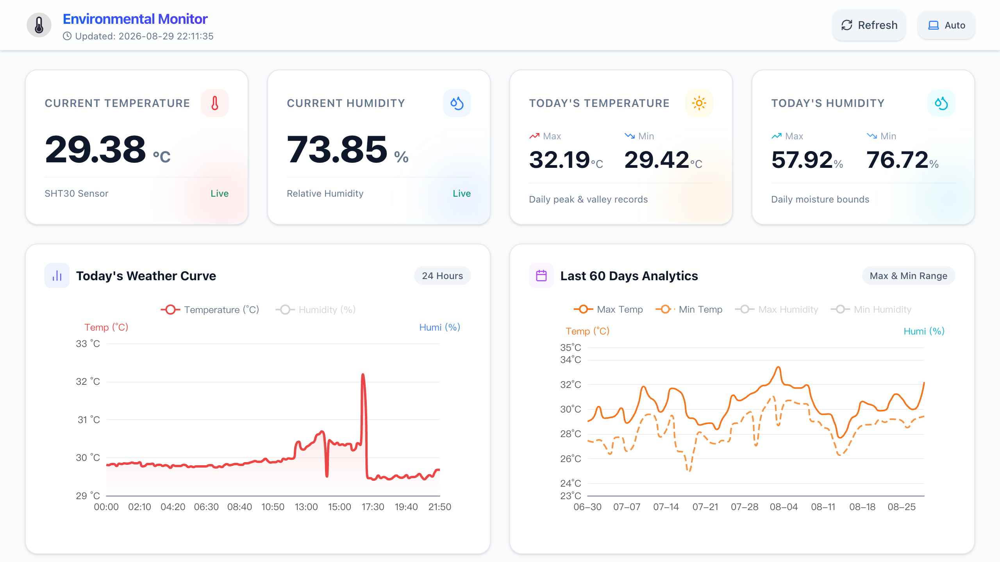

# SHT Viz


## Intro

**SHT Viz** is a lightweight, modern web-based monitoring and visualization system designed specifically for **Sensirion SHT series temperature and humidity sensors** running on the **Raspberry Pi** platform. It provides real-time data collection, interactive charts, and historical data persistence through a sleek and responsive user interface.

## Features

- **Real-time Monitoring**: Live tracking of temperature and humidity readings.
- **Interactive Dashboards**: Clean, responsive web UI for data visualization with historical trends.
- **Data Persistence**: Built-in database storage to record and analyze historical sensor data over time.
- **Dockerized Deployment**: Simple, containerized setup for effortless deployment and management on Raspberry Pi.
- **Hardware Integration**: Direct communication via I2C interface optimized for Raspberry Pi GPIO layout.

## Screenshot



## Hardware Connection

Before running the container, ensure your SHT sensor is correctly wired to the Raspberry Pi's physical GPIO pins for the I2C interface:

| Pin on SHT Sensor | Raspberry Pi Physical Pin | Description |
| :--- | :--- | :--- |
| **VCC** | Pin 1 or 17 (3.3V) | Power Supply (3.3V) |
| **GND** | Pin 6, 9, 14, etc. (Ground) | Ground |
| **SDA** | Pin 3 (GPIO 2 / I2C1 SDA) | I2C Data |
| **SCL** | Pin 5 (GPIO 3 / I2C1 SCL) | I2C Clock |

> **Note:** The default I2C address for the sensor is **`0x44`**. Make sure I2C is enabled on your Raspberry Pi (via `sudo raspi-config`).

## Quick Start

Run the following command to start the container on your Raspberry Pi:

```bash
sudo docker run -d \
--restart always \
--name sht \
-p <port>:8080 \
-v <database_port>:/app/db \
--device /dev/i2c-1 \
zhouc1230/sht:latest
```

*Replace `<port>` with your desired host port (e.g., `8080`) and `<database_port>` with your host path for data storage.*

## Updating

To update to the latest version, run:

```bash
sudo docker pull zhouc1230/sht:latest &&
sudo docker stop sht &&
sudo docker rm sht &&
sudo docker run -d \
--restart always \
--name sht \
-p <port>:8080 \
-v <database_port>:/app/db \
--device /dev/i2c-1 \
zhouc1230/sht:latest
```

## License

MIT License
